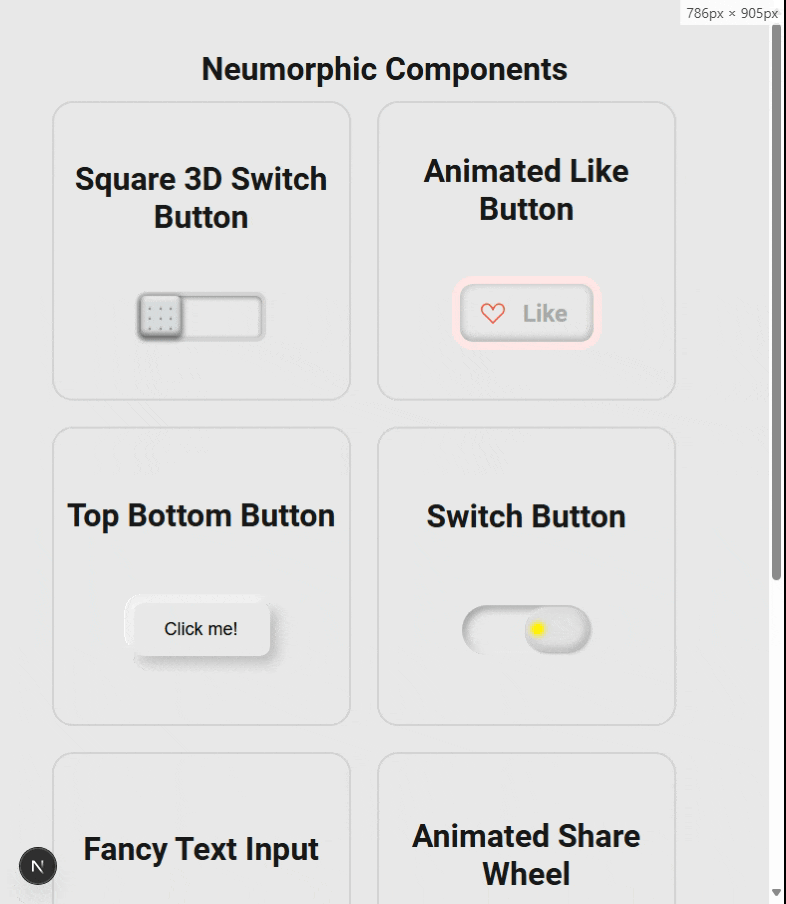

# Welcome to my neumorphic component library!
📖 This is a Next.js app aimed for studying, replying an creating neumorphic components, exploring at the best html and css features.

💡 This repository's goal is training my `HTML`, `CSS` and `React` skills
and futurely develop my own library or work without depending on any
UI libs, since none of them solves 100% every system needs.

## 🔨 Skills developed

- Create customized components for modern neumorphic UI
- Create my own UI library
- Be indempendent from other UI libraries
- Be able to create my own designs, with my preferences and ideas

## 🔥 Getting Started

Use your prefered Package Manager. I suggest using `Yarn`, since it's the defined
in the `package.json` file.

Before first run, install the dependencies using your package manager install command:
```bash
npm install
# or
yarn
# or etc.
```

Then, run the development server:
```bash
npm run dev
# or
yarn dev
# or etc.
```

#### ❗ Suggestion

If you are working at your own fork of this project, I recommend running in 
another terminal window, the command `tcm:watch` to update the css modules in 
real time.

Open [http://localhost:3000](http://localhost:3000). The URL will redirect you to 
`/home-page`, where you can see the library of components i've created so far.

<p align="center">
    
</p>


## Deploy on Vercel

The easiest way to deploy your Next.js app is to use the [Vercel Platform](https://vercel.com/new?utm_medium=default-template&filter=next.js&utm_source=create-next-app&utm_campaign=create-next-app-readme) from the creators of Next.js.

Check out our [Next.js deployment documentation](https://nextjs.org/docs/app/building-your-application/deploying) for more details.
